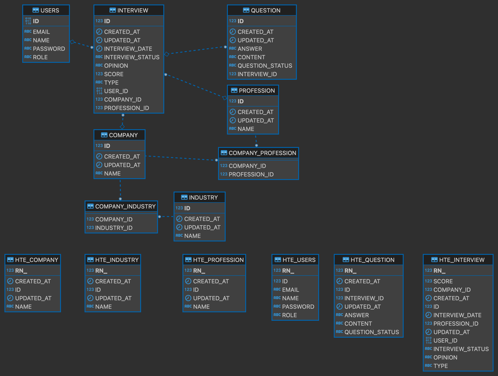

# Interview Nexus Server

## 🌟 About Interview Nexus

Interview Nexus is an open-source project aimed at creating a hub for interview processes. It's designed to enable people to share their interview experiences and the questions they were asked. This platform is in its early development phase, and we're excited to welcome contributors who are passionate about making the interview process more transparent and accessible to everyone.

### 🚀 Our Mission

- **Transparency**: Make interview processes more transparent.
- **Community**: Build a community where experiences and knowledge can be shared freely.
- **Support**: Provide a platform that supports job seekers in their preparation journey.

## 🎯 Features

- **View Interviews**: Open access for everyone to view shared interview experiences.
- **User Registration/Login**: Secure registration and login system using email and password.
- **Anonymity**: Ensures all interviews are shared anonymously to protect privacy.
- **Content Submission**: Users can submit their interview experiences.
- **Moderation**: Admins have the capability to approve or reject submissions to maintain quality.
- **User Interactions**: Users can edit or delete their submissions via their profiles.

## 🛠 Tech Stack

- **Programming Language**: Java SE 17
- **Build Tool**: Gradle 8.5
- **Web Framework**: Spring Boot 3.0
- **ORM**: Hibernate
- **Database**: Oracle Free Tier DB (Subject to change)

## 📚 Getting Started

### Setting Up Oracle DB

To install the Oracle database for development, use the following Docker command:

```sh
docker run --name interviewnexus-db \
-P -p 1521:1521 \
-e ORACLE_CHARACTERSET=AL32UTF8 \
-v /your/data/volume/path:/opt/oracle/oradata \
container-registry.oracle.com/database/free:latest
```

Please replace `/your/data/volume/path` with the path where you'd like to store the Oracle data files.

### ER Diagram

For a visual understanding of our current data model, here's the ER diagram:



## 💻 Frontend

For the frontend part of the project, visit: [Interview Nexus Frontend](https://github.com/enessefacetin/InterviewNexus-Web)

## 💡 Contributing

We're thrilled you're interested in contributing to Interview Nexus! Whether it's reporting a bug, discussing new features, or submitting pull requests, all contributions are welcome.

Here's how you can get started:

1. **Fork the repo** and create your branch from `main`.
2. **Make your changes** and test them.
3. **Send a pull request** with your changes.

Don't hesitate to reach out directly via [enessefacetin55@gmail.com](mailto:enessefacetin55@gmail.com) for more information on how you can contribute.

Together, we can make the interview process better for everyone. 🌟